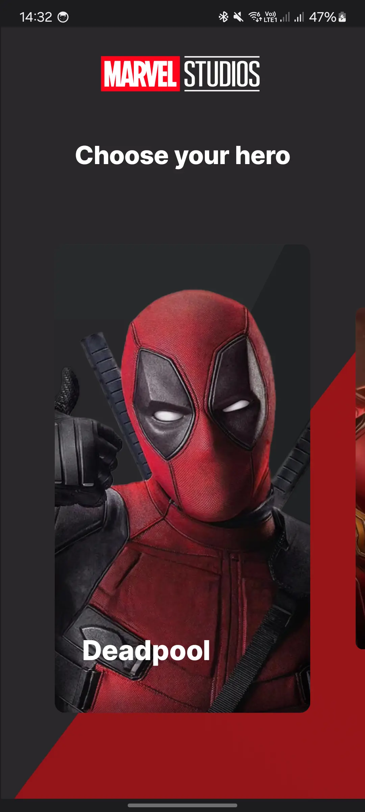
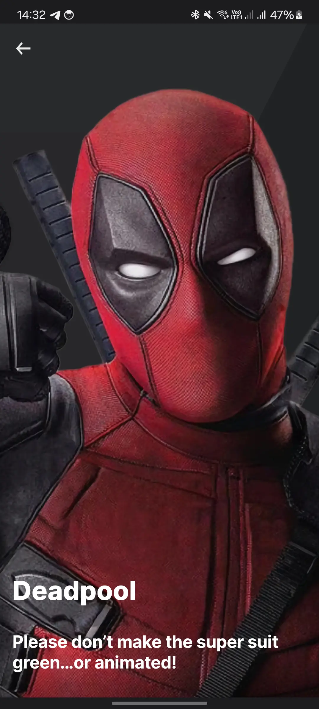

# Effective lab №1, Android

## How to run

* You need Android studio at least Hedgehog
* Run -> Run 'app'

# Screenshots

|              Main screen first state              |             Main screen second state              |
|:-------------------------------------------------:|:-------------------------------------------------:|
|  |  |

|                    Desc screen                    |
|:-------------------------------------------------:|
|  |

# Video

* <video src="https://github.com/DenisPopkov/MarvelApp/assets/57343209/79f1e47f-55dc-4e75-9749-2db4aed785cc" height="400"></video>

# APK

* [MarvelApp APK](assets/app-release.apk)

## Topics

* DI (Hilt)
* Jetpack Compose Based UI
* Jetpack Compose Navigation Component
* Gradle Configuration (Version catalog, gradle convention plugin)
* Coil
* Snap fling behavior
* Multi-module architecture
* ViewModel
* Data + Domain layers
* Coroutines

## Who to contact with questions

* [Popkov Denis](https://t.me/MolodoyDenis)
