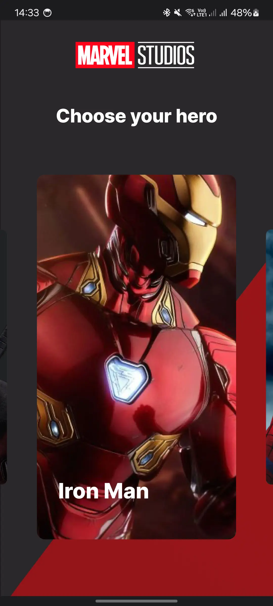

# Effective lab №1, Android

## How to run

* You need Android studio at least Hedgehog
* Run -> Run 'app'

# Screenshots

|               Main screen first state               |              Main screen second state               |
|:---------------------------------------------------:|:---------------------------------------------------:|
|    |    |
|                     Desc screen                     |                        Video                        |
| :-------------------------------------------------: | :-------------------------------------------------: |
|    |     <video src="assets/video.mp4" height="400">     |

# APK

* [MarvelApp APK](assets/app-debug.apk)

## Topics

* DI (Hilt)
* Jetpack Compose Based UI
* Jetpack Compose Navigation Component
* Gradle Configuration (Version catalog, gradle convention plugin)
* Coil
* Snap fling behavior
* Multi-module architecture
* ViewModel
* Data + Domain layers
* Coroutines

## Who to contact with questions

* [Popkov Denis](https://t.me/MolodoyDenis)
